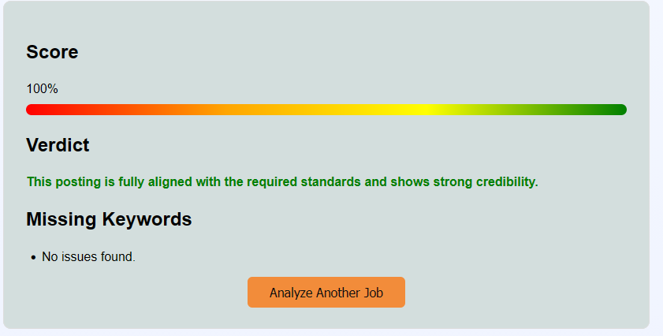

# 🧾 Job Analyzer — Ontario Job Posting Compliance Tool

> Instantly check if a job posting meets Ontario's 2026 Job Posting Requirements.

🔗 **Live App:** [www.beazatwork.com](https://www.beazatwork.com)

---

## Screenshots

**Low Compliance**


**Medium Compliance**


**Strong Compliance**


---

## What It Does

Ontario's new 2026 job posting law requires employers to include specific information in every job posting. Most job seekers don't know what's missing — and most postings fall short.

**Job Analyzer** lets you paste any job description and instantly find out:

- ✅ **Compliance Score** — out of 100
- 📋 **Verdict** — a one-sentence plain-language summary
- 🔍 **Missing Requirements** — a clear list of what the employer left out

When you're done, click **Analyze Another Job** to start fresh.

---

## How It Works

```
User pastes job description
        ↓
FastAPI backend analyzes it against Ontario 2026 requirements
        ↓
Returns: Score / Verdict / Missing Requirements
        ↓
Displayed instantly on beazatwork.com
```

---

## Tech Stack

| Layer | Technology |
|---|---|
| Frontend | WordPress + Custom Plugin |
| Backend | FastAPI (Python) |
| Deployment | Railway |
| Target Regulation | Ontario Employment Standards — Job Posting Law 2026 |

---

## Status

🟢 **Live** — available at [www.beazatwork.com](https://www.beazatwork.com)

---

## Notes

This is a proprietary application. Source code is not publicly available.  
For licensing, partnership, or integration inquiries, please reach out via [www.beazatwork.com](https://www.beazatwork.com).

---

*Built by a project manager turned developer, passionate about technology, learning Python, and making Ontario's employment laws accessible to everyday job seekers.*